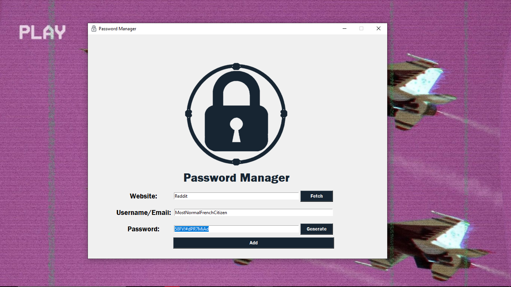
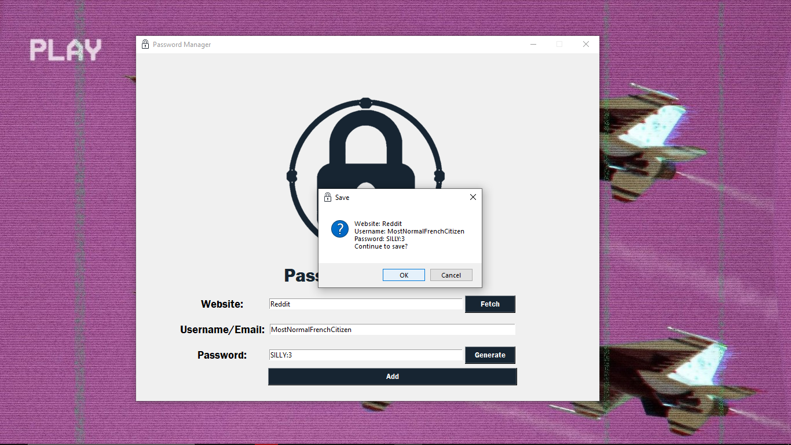
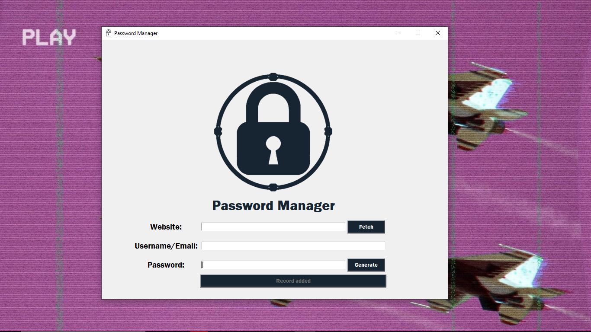

# Password Manager and Generator

Password Manager is a simple Python application for managing and storing passwords. It allows users to store, retrieve, edit, and generate random passwords.

## Usage

1. **Add a New Password:**
    - Enter the website, username/email, and password.
    - Click the "Add" button to save the credentials.

2. **Retrieve Password:**
    - Enter only the website name.
    - Click the "Fetch" button to retrieve the stored username and password.

3. **Generate Random Password:**
    - Click the "Generate" button to create a strong, random password.
    - Use the generated password for your accounts.

4. **Edit Existing Data:**
    - Edit an existing data by simply entering the new data for that website and clicking Add. No duplicates are stored.

## Screenshots
### Main Screen

### Fetch

### Edit

### Add/Save

